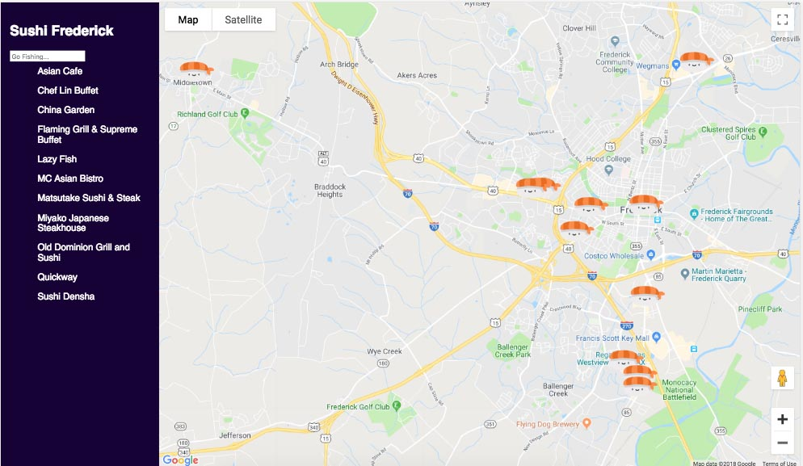

This project was bootstrapped with [Create React App](https://github.com/facebook/create-react-app).

# Udacity FEND Degree Program
---
### Neighborhood Map Project

# Table of Contents

* [Project Overview](#overview)
* [Specification](#specification)
* [Running the project](#how-to-run-the-project)
* [Resources](#resources)
* [Create React App](#create-react-app)
* [APIs Used](#apis-used)
* [Contributing](#contributing)

## Project Overview:

For the **Neighborhood Map Project** I built a single page application featuring a map of sushi restaurant locations in Frederick, MD, the city where I live. I added functionality to this map; including info windows, custom markers, a side bar list of the restaurants and search filtering of the restaurant list with associated markers filtered by a search. Location names and markers open an infowindow on click. The infowindow provides additional location information. Loaction information is provided by Foursquare API. Map is built with Google Maps API.

## Specification:

The goal of this project was to build a single page map application using React & Google Maps API, plus to integrate a third-party data API, in this case Foursquare, and make the app accessible and usable offline.



## Running the Project:

To run the project in the **development mode**, follow the instructions below:

Download or clone the repository in your computer:
```
$ git clone https://github.com/bailey-mae/neighborhood-map-app.git
```

In the repository folder:
```
npm install
```
* start the development server with
```
npm start
```
* open [http://localhost:3000](http://localhost:3000) to view it in the browser.

## Resources:

Project information can be found at [Udacity](https://www.udacity.com/)

Most of the code in this project has been written to the ES6 JavaScript specification for compatibility with modern web browsers and future proofing JavaScript code.

### Additional Source Material referenced in completing this project
[<em>Google Maps Developer Documentation</em>](https://developers.google.com/maps/documentation/javascript/tutorial)<br></br>
[<em>Google Developers YouTube Channel</em>](https://www.youtube.com/user/GoogleDevelopers/featured)<br></br>
[<em>Creating Markers in Google Maps</em>](https://developers.google.com/maps/documentation/javascript/markers)<br></br>
[<em>Google Maps Documentation for Infowindows</em>](https://developers.google.com/maps/documentation/javascript/infowindows)<br></br>
[<em>Removing Markers from Google Maps</em>](https://developers.google.com/maps/documentation/javascript/examples/marker-remove)<br></br>
[<em>Reactjs.org Create a new app with React</em>](https://reactjs.org/docs/create-a-new-react-app.html)<br></br>
[<em>Reactjs.org Information on State and Lifecycle</em>](https://reactjs.org/docs/state-and-lifecycle.html)<br></br>
[<em>FullStackreact: How to Write a Google Maps React Component</em>](https://www.fullstackreact.com/articles/how-to-write-a-google-maps-react-component/)<br></br>
[<em>How to use the FourSquare API - Foursquare API provides location information for this project</em>](https://developer.foursquare.com/docs/api/venues/search/)<br></br>
[<em>Using Axios to handle XMLHttp requests</em>](https://www.npmjs.com/package/axios)<br></br>
[<em>Tutorial for adding dynamic markers to Maps</em>](https://www.youtube.com/watch?v=nDJ00zO9X2U&t=52s)<br></br>
[<em>Medium.com Adding Custom Markers to Maps</em>](https://medium.com/@barvysta/google-marker-api-lets-play-level-0-custom-marker-icon-8ce7efed9a38)<br></br>
[<em>Custom Icon provided by Flat Icon</em><br></br>Creative Commons BY 3.0, Creative Commons License, available for use with crediting](https://www.flaticon.com/authors/freepik)<br></br>

## Create React App

This project was bootstrapped with [Create React App](https://github.com/facebookincubator/create-react-app). You can find more information on how to perform common tasks [here](https://github.com/facebookincubator/create-react-app/blob/master/packages/react-scripts/template/README.md).

## Contributing

This repository was created as an assignment for the Udacity FEND degree and represents coursework, because of this pull requests will most likely not be accepted.

For details, check out [CONTRIBUTING.md](CONTRIBUTING.md).
